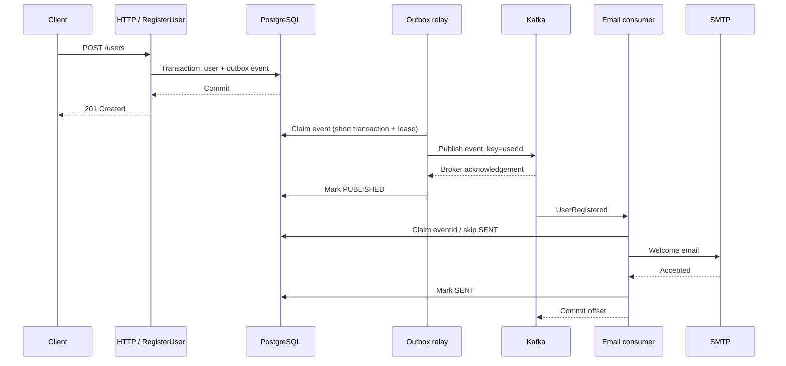

# Welcome email — Spring Boot, Clean Architecture, Kafka

Project Java 17+, Spring Boot 3.5.16, Maven, PostgreSQL, Flyway, Kafka KRaft và SMTP.
Phạm vi: tạo user rồi gửi email chào mừng bất đồng bộ. Đây chưa phải hệ thống auth:
không có password, login, xác minh email hay rate limit.

## Kiến trúc

```text
com.example.welcome
├── domain                     User, UserRegistered (Java thuần)
├── application                RegisterUser, PublishPendingEvents, SendWelcomeEmail
│   └── port                   Hợp đồng DB, outbox, event publisher, email sender, delivery store
├── adapter
│   ├── in/web                 HTTP controller, validation, error mapping
│   ├── in/scheduling          Đánh thức outbox relay
│   ├── in/kafka               Kafka listener, validation event JSON
│   ├── out/persistence        PostgreSQL/JDBC, transaction và claim lease
│   ├── out/kafka              Kafka publisher
│   └── out/email              SMTP sender
└── configuration              Composition root: wiring use cases, topic, retry/DLT
```

Luật phụ thuộc: application chỉ phụ thuộc domain và port của application; domain
không phụ thuộc application. Cả hai lớp không import Spring, Kafka, JDBC hoặc Jackson.
Adapters implement port và gọi use case. Spring wiring nằm ngoài core.
ArchUnit kiểm tra hai ranh giới này khi chạy test. Dùng một Maven module với ranh giới
package; có thể tách module khi cần phát hành hoặc triển khai riêng.



## Chạy toàn bộ bằng Docker

Cần Docker Desktop với Linux containers. Không cần cài JDK/Maven trên máy:

```powershell
docker compose up -d --build
docker compose logs -f app
```

Dockerfile chạy unit/architecture test khi build, rồi đóng gói app. App chạy dưới user
không phải root. PostgreSQL và Kafka có healthcheck; dữ liệu lưu trong named volumes.
Các port chỉ bind localhost. Chờ log `Started WelcomeApplication` trước khi gọi API.

```powershell
$body = @{ email = 'thanh@example.test'; name = 'Thanh' } | ConvertTo-Json
Invoke-RestMethod -Method Post -Uri http://localhost:8080/users -ContentType application/json -Body $body
```

HTTP 201 trả `id` và `message`. Email xuất hiện tại <http://localhost:8025> (Mailpit,
SMTP sandbox giữ email cục bộ). Email trùng trả 409 với code `EMAIL_ALREADY_REGISTERED`;
request không hợp lệ trả 400 với code `INVALID_INPUT`.

Request không gọi Kafka/SMTP: sự kiện đã được ghi bền vững trong DB trước khi trả 201.
Kafka/SMTP lỗi không rollback user đã tạo.

Nếu chạy app tại IDE, chỉ bật hạ tầng:

```powershell
docker compose up -d postgres kafka mailpit
mvn spring-boot:run
```

Không chạy app từ IDE và container `app` cùng lúc trên port 8080. Defaults dành cho local:
DB `localhost:5432/welcome`, tài khoản `welcome/welcome`, Kafka `localhost:9092`,
SMTP `localhost:1025`. Có thể ghi đè `DB_URL`, `DB_USERNAME`, `DB_PASSWORD`,
`KAFKA_BOOTSTRAP_SERVERS`, `SMTP_HOST`, `SMTP_PORT`, `SMTP_USERNAME`, `SMTP_PASSWORD`,
`SMTP_AUTH`, `SMTP_STARTTLS`, `MAIL_FROM`, `SERVER_ADDRESS`.

Demo H2 cũ đã được thay bằng PostgreSQL; file `data/` cũ không được đọc hay tự migrate.

## Event và retry

Topic `users.registered.v1`, key là `userId`, value là JSON:

```json
{
  "eventId": "6171d3f9-20e4-49bc-9328-1f20a8c69c22",
  "userId": "071597c4-1c53-4775-bc24-4f0bf1c9c914",
  "email": "thanh@example.test",
  "name": "Thanh",
  "occurredAt": "2026-10-04T07:00:00Z"
}
```

Giữ nguyên `eventId` trong mọi lần publish lại/replay. Topic v1 là hợp đồng schema;
thay đổi không tương thích cần kế hoạch nâng version. Consumer group `welcome-email-v1`,
3 partitions và 3 listener threads; replication factor 1 dành cho môi trường local.

- **Outbox:** `FOR UPDATE SKIP LOCKED` và lease 60 giây; không giữ transaction khi gọi
  Kafka. Chỉ ghi PUBLISHED sau khi broker ack. Broker lỗi: retry sau 5 giây, không giới hạn
  số lần; crash: event PROCESSING được claim lại khi lease hết hạn.
- **Consumer:** `enable-auto-commit=false`, ack RECORD sau khi listener thành công.
  Lỗi gửi email được retry 4 lần sau 2, 4, 8, 16 giây (5 lần xử lý tổng cộng).
  Đây là blocking retry: partition đang lỗi sẽ chờ; nên dùng retry topics nếu cần trì
  hoãn dài hoặc lưu lượng cao.
- **DLT:** hết retry chuyển bản ghi sang `users.registered.v1.DLT`, giữ key/payload gốc.
  JSON/fields không hợp lệ đi thẳng DLT. Nếu publish DLT thất bại, recoverer ném lỗi để
  tránh bỏ qua bản ghi gốc. Không có listener tự tiêu thụ DLT.
- **Dedup:** bảng `email_delivery` claim theo eventId với lease, SENT được bỏ qua.
  Khi lease đang bận, policy riêng chờ 5 giây, tối đa 12 retry để có thể phục hồi lease
  sau crash. Producer idempotence giảm duplicate từ producer retry, không loại bỏ
  duplicate giữa lần Kafka publish và cập nhật DB.

## Demo lỗi và kiểm tra trạng thái

```powershell
docker compose stop kafka
# Gọi POST /users với email mới: vẫn trả 201, event giữ trong outbox.
docker compose start kafka
# Relay sẽ tiếp tục publish.

docker compose stop mailpit
# Gọi POST /users với email mới, chờ retry rồi kiểm tra DLT.
docker compose start mailpit
```

```powershell
docker compose exec postgres psql -U welcome -d welcome -c "SELECT event_id, status, attempts, available_at FROM outbox_event ORDER BY created_at;"
docker compose exec postgres psql -U welcome -d welcome -c "SELECT event_id, status, lease_until, sent_at FROM email_delivery;"
docker compose exec kafka /opt/kafka/bin/kafka-console-consumer.sh --bootstrap-server kafka:29092 --topic users.registered.v1.DLT --from-beginning --timeout-ms 10000 --property print.key=true --property 'key.separator=|'
```

Consumer CLI sẽ thoát khi hết timeout nếu không có thêm bản ghi. `email_delivery` có
thể vẫn PENDING khi event đã vào DLT: trạng thái DLT thuộc Kafka, không nằm trong DB.

Sau khi sửa lỗi SMTP, chọn đúng bản ghi DLT để replay. Mở producer bên dưới và paste
một dòng `userId|JSON` lấy từ DLT, giữ nguyên eventId; kết thúc bằng Ctrl+C:

```powershell
docker compose exec kafka /opt/kafka/bin/kafka-console-producer.sh --bootstrap-server kafka:29092 --topic users.registered.v1 --property parse.key=true --property 'key.separator=|'
```

SENT được dedup, PENDING sẽ thử gửi lại; nếu lease chưa hết hạn consumer sẽ chờ.
Không reset offsets toàn bộ consumer group để gửi lại một email.

## Kiểm chứng

```powershell
# Unit use cases và ArchUnit, không cần DB/Kafka/Docker.
mvn test

# Thêm integration test với PostgreSQL + Kafka thật do Testcontainers quản lý.
# Cần Docker và quyền tải image. SMTP được mock để kiểm soát lỗi.
mvn -Pintegration verify
```

Integration test gồm HTTP → outbox → Kafka → email, rollback khi insert outbox lỗi,
claim độc quyền và token cũ, dedup, retry/DLT, validation và email trùng.
Unit tests kiểm tra normalization, publish chỉ đánh dấu sau ack, publish failure,
SMTP success/failure, SENT dedup và lease BUSY.

Trong môi trường tạo project, JDK/cache dependencies của IDE cho phép compile và chạy
unit/architecture tests bằng JUnit launcher. Maven test đầy đủ chưa chạy được vì cache
Surefire thiếu dependencies; integration tests và Docker Compose chưa chạy vì không có
Docker. Các lệnh trên là cách kiểm chứng trên máy có đầy đủ công cụ và network.

## Giới hạn cần biết

- **At-least-once, không bảo đảm exactly-once email.** SMTP đã nhận nhưng app chết trước
  khi ghi SENT có thể dẫn tới gửi trùng. Dùng API provider có idempotency key theo eventId
  nếu yêu cầu mạnh hơn. Lease không thay thế idempotency ở nhà cung cấp; nếu I/O kéo dài
  vượt 60 giây hoặc JVM pause lâu, cũng có thể trùng.
- API và consumer cùng một process để chạy demo dễ dàng, nhưng đã tách qua ports/use cases.
- PostgreSQL/Kafka dùng credentials và PLAINTEXT cho local. Cấu hình secrets, TLS/SASL,
  Kafka ACL và auth API trước khi triển khai thực tế. Kafka cần nhiều broker/replicas phù hợp.
- SENT nghĩa SMTP chấp nhận gửi, không chứng minh đã tới inbox. Chưa xử lý bounce/webhook.
- Chưa có cleanup outbox/dedup, metrics hoặc cảnh báo DLT/backlog; giữ dedup lâu hơn cửa sổ
  Kafka retention và replay. Mặc định topic có thể hết retention, cần chọn theo yêu cầu thực tế.
- POST chưa hỗ trợ Idempotency-Key. Nếu response bị mất, retry cùng email có thể nhận 409.

Tài liệu chính thức: [Spring Kafka error handling](https://docs.spring.io/spring-kafka/reference/kafka/annotation-error-handling.html),
[Spring Boot email](https://docs.spring.io/spring-boot/3.5/reference/io/email.html),
[Testcontainers Kafka](https://java.testcontainers.org/modules/kafka/),
[transactional outbox](https://docs.aws.amazon.com/prescriptive-guidance/latest/cloud-design-patterns/transactional-outbox.html).
